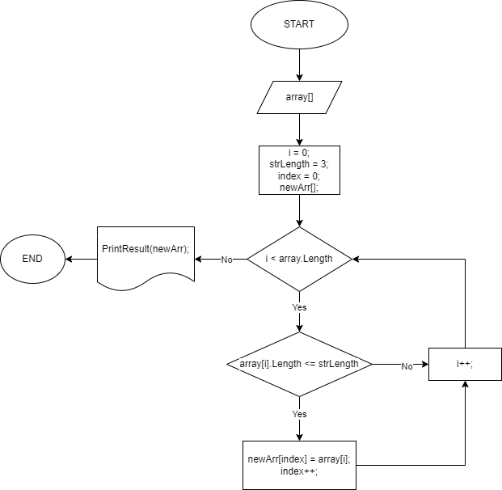

# Итоговая контрольная работа №1 по основному блоку
## Задание:
1. Создать репозиторий на GitHub
2. Нарисовать блок-схему алгоритма (можно обойтись блок-схемой основной содержательной части, если вы выделяете её в отдельный метод)
3. Снабдить репозиторий оформленным текстовым описанием решения (файл README.md)
4. Написать программу, решающую поставленную задачу
5. Использовать контроль версий в работе над этим небольшим проектом (не должно быть так, что всё залито одним коммитом, как минимум этапы 2, 3, и 4 должны быть расположены в разных коммитах)

## Задача:
Написать программу, которая из имеющегося массива строк формирует новый массив из строк, длина которых меньше, либо равна 3 символам. Первоначальный массив можно ввести с клавиатуры, либо задать на старте выполнения алгоритма. При решении не рекомендуется пользоваться коллекциями, лучше обойтись исключительно массивами.

## Блок-схема основного метода 

## Решение
Приведенный код представляет собой консольное приложение на языке **C#**, которое считывает введенные пользователем данные в виде строки, разделенной запятыми, с помощью метода `ReadeConsole(string message)`, преобразует его в массив отдельных строк с помощью метода `Split(',')`, отфильтровывает короткие строки с помощью метода `FilterShortStrings(string[] arr, int length)`, а затем отображает конечный результат в окне консоли с использованием метода `PrintResult(string[] strs)`.

### Описание методов
* `ReadeConsole(string message)` принимает строку сообщения в качестве своего параметра, а затем выводит сообщение в окно консоли. Затем он возвращает введенные пользователем данные в виде строки с помощью метода `Console.ReadLine()`.
* `FilterShortStrings(string[] arr, int length)` принимает массив строк и размер искомой строки в качестве своих параметров, а затем создает новый массив строк с той же длиной. Затем он выполняет итерацию по каждой строке во входном массиве и проверяет, является ли ее длина (после обрезки любых пробелов) меньше или равна параметру *length*. Если это так, то строка добавляется в новый массив. Метод, наконец, возвращает этот новый строковый массив.
* `PrintResult(string[] strs)` принимает в качестве своего параметра массив строк и выполняет итерацию по всем его элементам один за другим. Если элемент массива не равен *null* или не пуст, он выводится в окне консоли через запятую.
